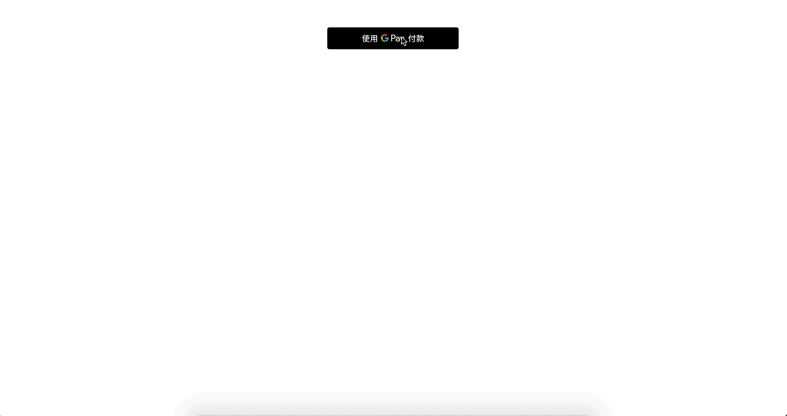

# Google Pay 

## DEMO 


## Required

1. 請到 TapPay Portal 申請帳號，取得 APP_ID 和 APP_KEY
2. 必須使用 v4 版的 SDK
3. Android Lollipop (5.0) or higher, iPhone & iPad running iOS 7 or higher

## Overview

1. 引入 SDK 並且初始化 APP_ID, APP_KEY, SERVER_TYPE
2. 利用 SDK getPrime API 取得 prime
3. 將 prime 回傳給您的伺服器，並透過 pay-by-prime 來完成付款

## 教學 

### Step 1 

首先我們要建立出付款頁面 `index.html` 並且在 `<head></head>` 中引入 SDK, google pay.js

```html
<script src="https://pay.google.com/gp/p/js/pay.js"></script>
<script src="https://js.tappaysdk.com/tpdirect/v5.4.0"></script>
<script>
    TPDirect.setupSDK(APP_ID, "APP_KEY", 'SERVER_TYPE')
</script>
```

### Step 2

設定 Google Pay Merchant 設定
請填入 Google 申請的 Google Merchant ID 以及跟 TapPay 申請的 Merchant ID 

```javascript
var googlePaySetting = {

    // Optional in sandbox, Required in production
    googleMerchantId: "Come from google portal",

    allowedCardAuthMethods: ["PAN_ONLY", "CRYPTOGRAM_3DS"],
    merchantName: "TapPay Test!",
    emailRequired: true, // optional
    shippingAddressRequired: true, // optional,
    billingAddressRequired: true, // optional
    billingAddressFormat: "MIN", // FULL, MIN

    allowPrepaidCards: true,
    allowedCountryCodes: ['TW'],

    phoneNumberRequired: true // optional
}
TPDirect.googlePay.setupGooglePay(googlePaySetting)
```

### Step 3 

```javascript
var paymentRequest = {
    allowedNetworks: ["AMEX", "JCB", "MASTERCARD", "VISA"],
    price: "123", // optional
    currency: "TWD", // optional
}

TPDirect.googlePay.setupPaymentRequest(paymentRequest, function(err, result){
    if (result.canUseGooglePay) {
        canUseGooglePay = true
    }
})
```

### Step 4

此 function 為 optional，如果在setupPaymentRequest 就已經設定金額的話，
就不用使用此 function，如果還未設定，請在 get prime 之前把金額設定好

```javascript
TPDirect.googlePay.setupTransactionPrice({
    price : "123",
    currency: "TWD"
})
```

### Step 5 

設定 Google Pay Button 此為 optional 的設定，
如果要自己放置 Google Pay Button 則可不使用此功能

```javascript
TPDirect.googlePay.setupGooglePayButton({
    el: "#container",
    color: "black",
    type: "long",
    getPrimeCallback: function(err, prime){
        if (err) {
            return
        }
        // Send prime to your server, call pay by prime API.
    }
})
```

### Get Prime 

如果沒有使用 setupGooglePayButton 的話，請呼叫 getPrime 去觸發 Google Pay 
如果有用 setupGoogleButton，此功能可以不使用

```
TPDirect.googlePay.getPrime(function(err, prime){
    // Get the prime, and send it to Server
})
```