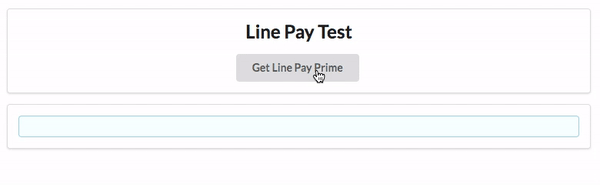

# LINE Pay with TapPay

## DEMO



## Required

1. 請搭配 web SDk v2.3.3 使用 LINE Pay, 舊版本不支援 LINE Pay
2. 請到 TapPay Portal 申請帳號，取得 APP_ID 和 APP_KEY

## Overview

1. 前端用 `TPDirect.linePay.getPrime()` 拿到 line pay 專屬的 `prime`
2. 前端把 `prime` 送到後端伺服器
3. 前端等待後端伺服器回傳 `payment_url` 並使用 `TPDirect.redirect(payment_url)` 的方式讓使用者進行 line pay 付款


## 教學

### Step 1

首先我們要建立出付款頁面 `index.html` 並且在 `<head></head>` 中引入 SDK

```html
<script src="https://js.tappaysdk.com/tpdirect/v5.4.0"></script>
```

### Step 2

初始化 TapPay SDK

```js
TPDirect.setupSDK(APP_ID, "APP_KEY", 'SERVER_TYPE')
```

### Step 3

使用 `TPDirect.linePay.getPrime(callback)` 去拿 `prime`

```js
TPDirect.linePay.getPrime(function(result) {
    // code
})
```

result 的資料格式為

名稱 | 型別 | 內容
--- | --- | ---
status | Int | 錯誤代碼，0 為成功
msg | String | 錯誤訊息
prime | String | prime 字串 `ln_` 開頭，於 <a href="https://docs.tappaysdk.com/line-pay/zh/back.html#pay-by-prime">Pay by Prime</a> 交易時使用
clientip | String | 交易者的 IP 位置

### Step 4

等待後端伺服器回傳 `payment_url`，然後請使用 `TapPay.redirect(payment_url)` 跳轉

### 完整 index.html 頁面

```html
<!DOCTYPE html>
<html>

<head>
    <meta charset="UTF-8">
    <meta name="viewport" content="width=device-width, initial-scale=1">
    <title>LINE Pay Example</title>
    <script src="https://code.jquery.com/jquery-1.10.1.min.js"></script>
    <link rel="stylesheet" href="https://cdnjs.cloudflare.com/ajax/libs/semantic-ui/2.2.13/semantic.min.css">
    <script src="https://cdnjs.cloudflare.com/ajax/libs/semantic-ui/2.2.13/semantic.min.js"></script>
    <script src="https://js.tappaysdk.com/tpdirect/v5.4.0"></script>
    <script>
        TPDirect.setupSDK(APP_ID, "APP_KEY", 'SERVER_TYPE')
    </script>
</head>

<body>
    <div class="payment-view ui grid centered stackable doubling">
        <br>
        <div class="row"></div>
        <div class="ten wide column ">
            <div class="ui center aligned segment">
                <h2>LINE Pay Test</h2>
                <button id='sendButton' class="ui button">Pay with LINE Pay</button>
            </div>
            <div class="ui segment">
                <pre id="result1" class="ui info message"></pre>
            </div>
        </div>
    </div>
</body>
<script>
    // 還未付款的頁面 index.html
    // 需要把 prime 送到伺服器
    var sendButton = document.getElementById("sendButton")
    $('button#sendButton').click(function() {
        TPDirect.linePay.getPrime(function (result) {
            // result 就是 get prime 拿到的結果
            document.querySelector('#result1').innerHTML = JSON.stringify(result, null, 4)
            // 拿到 get prime 結果後就需要往後端伺服器送
            // 然後再用 TapPay.redirect(payment_url) 到 Line Pay 付款頁面
var command = `Use following command to send to server \n\n
curl -X POST https://sandbox.tappaysdk.com/tpc/payment/pay-by-prime
-H 'content-type: application/json'
-H 'x-api-key: YOUR_PARTNER_KEY'
-d '{
    "partner_key": "YOUR_PARTNER_KEY",
    "prime": "${result.prime}",
    "amount": "1",
    "merchant_id": "YOUR_MERCHANT",
    "details": "Some item",
    "cardholder": {
        "phone_number": "+886923456789",
        "name": "王小明",
        "email": "LittleMing@Wang.com",
        "zip_code": "100",
        "address": "台北市天龍區芝麻街1號1樓",
        "national_id": "A123456789"
    },
    "result_url": {
        "frontend_redirect_url": "https://your.server.com/notify",
        "backend_notify_url": "https://your.server.com/notify"
    }
}'`
        })
    })
</script>
</html>
```
