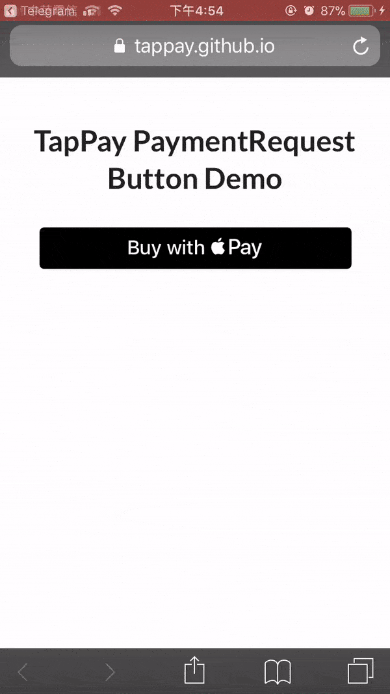

# TapPay Payment Button

## DEMO
iPhone Phone 打開後



Android Phone 打開後


## 注意

在 Sandbox 環境下使用 Pay with Google 的時候，底下出現紅字『無法識別應用程式』  
這是正常行為，毋須擔心。這是在測試環境下面會出現的警告  
在 Production 環境下使用 Pay with Google，底下就不會出現紅字

## Required

1. 請到 TapPay Portal 申請帳號，取得 APP_ID 和 APP_KEY
2. 必須使用 v3 版的 SDK
3. 根據所需要不同的付款方式選擇不同的參數設定，此範例是把_**所有付款方式**_都融合進來，所以需要 Apple Pay、Pay with Google 所有特有參數才能進行
4. Pay with Google 僅支援 Android Mobile Web、Chrome M61 版本後以及 Google Play Services version 11.4.x 版本後

### Overview

1. 引入 SDK 並且初始化 APP_ID, APP_KEY, SERVER_TYPE
2. 使用 `TPDirect.paymentRequestApi.checkAvailability()` 檢查瀏覽器是否可以用 Payment Request API
3. 設置 Payment Request Data, 並且在 `supportedMethods` 填入 `["card", "android_pay", "pay_with_google", "apple_pay"]` 四種
4. 設置 Pay with Google 特有的參數 `TPDirect.paymentRequestApi.setupPayWithGoogle`，Pay with Google 相關必要參數可以參考 [Pay with Google 教學](../Pay_with_Google)
5. 設置 Apple Pay 特有的參數 `TPDirect.paymentRequestApi.setupApplePay`，Apple Pay 相關必要參數可以參考 [Apple Pay 教學](../Apple_Pay)
6. 設置 TapPay Payment Button 位置

## 教學

### Step 1

首先我們要建立出付款頁面 `index.html` 並且在 `<head></head>` 中引入 SDK

```html
<script src="https://js.tappaysdk.com/tpdirect/v5.13.0"></script>
<script>
    TPDirect.setupSDK(APP_ID, "APP_KEY", 'SERVER_TYPE')
</script>
```

### Step 2

再來要檢查瀏覽器使否可以使用 Payment Request API  
可以使用 `TPDirect.paymentRequestApi.checkAvailability()` 確認使否能使用

### Step 3

確認可以使用 Payment Request API 之後  
建立出 Payment Request Data，並且在 `supportedMethods` 裡面填入 `card` `android_pay` `apple_pay`  
詳細參數設定請參考[文件](https://docs.tappaysdk.com/payment-request-api/zh/front.html#paymentrequest)

```javascript
var data = {
    supportedNetworks: ['MASTERCARD', 'VISA', 'AMEX'],
    supportedMethods: ['card', 'pay_with_google', 'apple_pay'],
    displayItems: [{
        label: 'iPhone8',
        amount: {
            currency: 'TWD',
            value: '1.00'
        }
    }],
    total: {
        label: '付給 TapPay',
        amount: {
            currency: 'TWD',
            value: '1.00'
        }
    },
    shippingOptions: [{
            id: "standard",
            label: "🚛 Ground Shipping (2 days)",
            // apple pay only
            detail: 'Estimated delivery time: 2 days',
            amount: {
                currency: "TWD",
                value: "5.00"
            }
        },
        {
            id: "drone",
            label: "🚀 Drone Express (2 hours)",
            // apple pay only
            detail: 'Estimated delivery time: 2 hours',
            amount: {
                currency: "TWD",
                value: "25.00"
            }
        },
    ],
    // optional
    options: {
        requestPayerEmail: false,
        requestPayerName: false,
        requestPayerPhone: false,
        requestShipping: false,
        // https://docs.tappaysdk.com/payment-request-api/zh/reference.html#shippingtype
        shippingType: 'shipping'
    }
}
```

### Step 4

設置 Pay with Google 特有的參數

```javascript
TPDirect.paymentRequestApi.setupPayWithGoogle({
    // defaults to ['CARD', 'TOKENIZED_CARD']
    allowedPaymentMethods: ['CARD', 'TOKENIZED_CARD'],

    // Indicates whether or not you allow prepaid debit cards as a form of payment.
    // Set to true to allow prepaid debit cards. Otherwise, set to false.
    // defaults to true
    allowPrepaidCards: true,

    // defaults to false
    billingAddressRequired: false,
    // defaults to  'MIN'
    billingAddressFormat: 'MIN', // FULL, MIN

    // Set the ISO 3166-1 alpha-2 formatted country codes of the countries to which shipping is allowed.
    // If not specified, all countries are allowed.
    // defaults to undefined (allow all shipping address)
    // allowedCountryCodes: ['TW']
})
```

### Step 5

設置 Apple Pay 特有的參數

```javascript
TPDirect.paymentRequestApi.setupApplePay({
    // required, your apple merchant id
    // merchant.tech.cherri.global.test 是 DEMO 頁面專門使用的 merchant id
    // 如果要在自己頁面上使用 Apple Pay 請參考 Required 去申請 Apple Pay merchant id
    merchantIdentifier: 'merchant.tech.cherri.global.test',
    // defaults to 'TW'
    countryCode: 'TW'
})
```

### Step 6

接下來啟用 Payment Request API
`TPDirect.paymentRequestApi.setupPaymentRequest(data, function(result){})`  
第一個參數 data 是剛剛宣告的 payment request data  
第二個參數回傳的 result 會有以下幾個屬性  

1. `result.browserSupportPaymentRequest`

2. `result.canMakePaymentWithActiveCard`
    `canMakePaymentWithActiveCard` 在 apple pay 只會檢查使用者使否會綁定卡片

設置完之後，開始設定 Tappay Payment Button 的位置  
Get Prime Result 可以參考[文件上的資料](https://docs.tappaysdk.com/payment-request-api/zh/front.html#get-prime-result)

```javascript
TPDirect.paymentRequestApi.setupPaymentRequest(data, function (result) {
    // result.browserSupportPaymentRequest
    // result.canMakePaymentWithActiveCard
    if (!result.browserSupportPaymentRequest) {
        $('#pr-button').css('display', 'none')
        $('#browser-no-support-message').removeClass('hidden')
        return
    }
    TPDirect.paymentRequestApi.setupTappayPaymentButton('#pr-button', (getPrimeResult) => {
        $('#get-prime-result').removeClass('hidden')
        $('#get-prime-result pre code').text(JSON.stringify(getPrimeResult, null, 2))
        $('.get-prime-status').addClass('hidden')
        console.log(getPrimeResult)
        if (getPrimeResult.status !== 0) {
            console.log('getPrime failed: ' + getPrimeResult.msg)
            $('#get-prime-failed-message').removeClass('hidden')
            return
        }
        // send prime to server
        console.log('prime: ' + getPrimeResult.prime)
        $('#get-prime-success-message').removeClass('hidden')
        $('#get-prime-success-message p').text(getPrimeResult.prime)
    })
})
```

### 完整 index.html 頁面

[TapPay Payment Request API - TapPay Payment Button Example](./example/index.html)