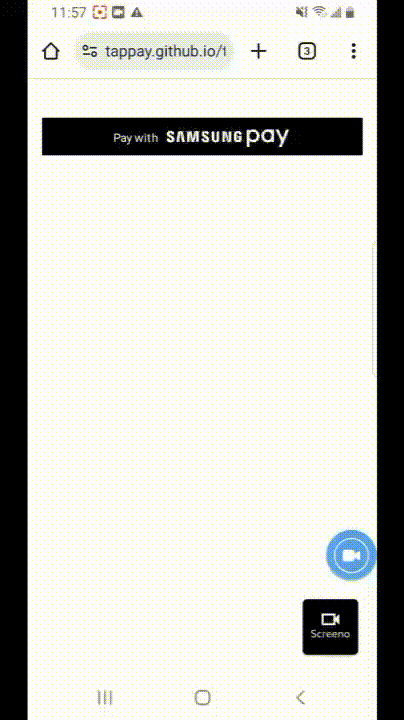

# Samsung Pay

## DEMO



## Required

1. 請到 TapPay Portal 申請帳號，取得 APP_ID 和 APP_KEY
2. 必須使用 v3 版的 SDK
3. 需要有註冊 Samsung Pay 的三星手機，以完成驗證


### Overview

1. 引入 SDK 並且初始化 APP_ID, APP_KEY, SERVER_TYPE
2. 使用 `TPDirect.samsungPay.setup` 設定驗證頁面的語言
3. 使用 `TPDirect.samsungPay.setupPaymentRequest` 設定接受的卡別、商家名稱、金額
4. 使用 `TPDirect.samsungPay.setupSamsungPayButton` 設定 Samsung Pay 按鈕
5. 使用 `TPDirect.samsungPay.getPrime` 開始 Samsung Pay 驗證流程，完成之後會在 callback 取得 prime


## 教學

### Step 1

首先我們要建立出付款頁面 `index.html` 並且在 `<head></head>` 中引入 SDK

```html
<script src="https://js.tappaysdk.com/tpdirect/v5.4.0"></script>
<script>
    TPDirect.setupSDK(APP_ID, 'APP_KEY', 'SERVER_TYPE')
</script>
```


### Step 2

使用 `TPDirect.samsungPay.setup` 設定驗證頁面的地區語言，請參考文件以取得 [country_code 列表](https://docs.tappaysdk.com/samsung-pay/zh/reference.html#samsung_pay_country_code)

```javascript
TPDirect.samsungPay.setup({
    country_code: 'tw'
})
```


### Step 3

使用 `TPDirect.samsungPay.setupPaymentRequest` 設定接受的卡別、商家名稱、金額

```javascript
var paymentRequest = {
    // Optional, 預設全部支援
    supportedNetworks: ['VISA', 'MASTERCARD'],
    total: {
        // 此為在手機上會顯示的商家名稱
        label: '商家名稱',
        amount: {
            currency: 'TWD',
            value: '50'
        }
    }
}
TPDirect.samsungPay.setupPaymentRequest(paymentRequest)
```


### Step 4

在要擺放 Samsung Pay 按鈕的位置，新增一個 `<div>`，並使用 `TPDirect.samsungPay.setupSamsungPayButton` 設定 Samsung Pay 按鈕

> 請參考 Samsung Pay 的 [Branding guidelines](https://pay.samsung.com/developers/resource/brand) 以選擇適當的按鈕樣式

```html
<div id="samsung-pay-button"></div>
```

```javascript
TPDirect.samsungPay.setupSamsungPayButton('#samsung-pay-button', {
    // black, white
    color: 'black',
    // pay, buy
    type: 'pay',
    // rectangular, pill
    shape: 'rectangular'
})
```


### Step 5

使用 `TPDirect.samsungPay.getPrime` 開始 Samsung Pay 驗證流程，完成之後會在 callback 取得 prime


```javascript
TPDirect.samsungPay.getPrime(function (result) {
    if (result.status !== 0) {
        return console.error('samsungPay getPrime failed: ' + result.msg)
    }

    // 把 prime 傳到您的 server，並使用 Pay by Prime API 付款
    var prime = result.prime

    // 此為用戶選擇的卡片
    // 注意：此卡號為實體卡號（非 token 卡號）
    var card_lastfour = result.card.lastfour
    var card_type = result.card.type
})
```


### 完整 index.html 頁面

[TapPay Samsung Pay Example](./example/index.html)